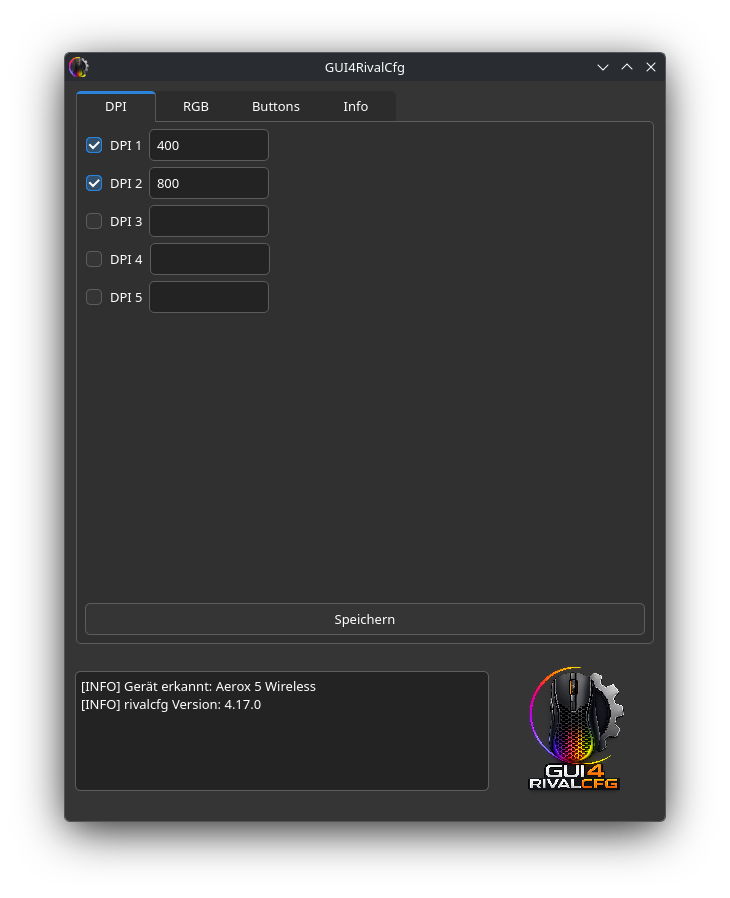
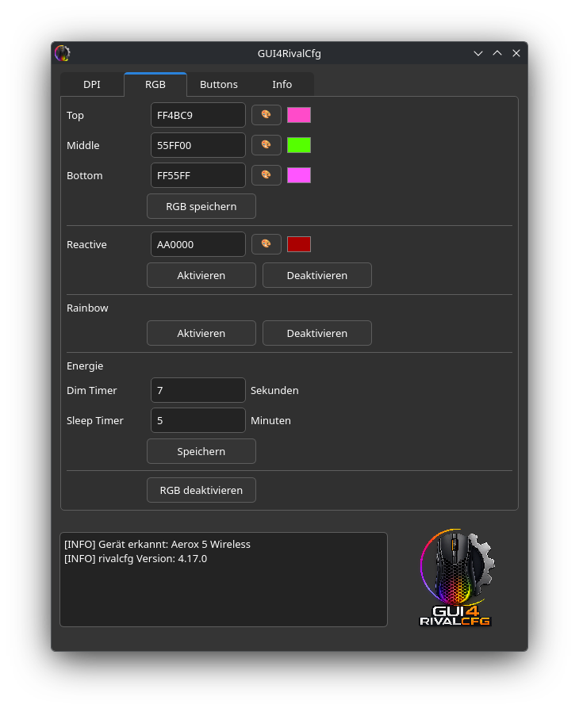
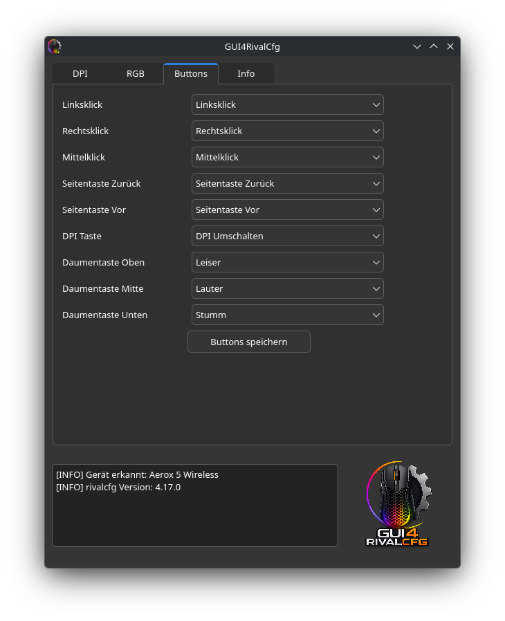
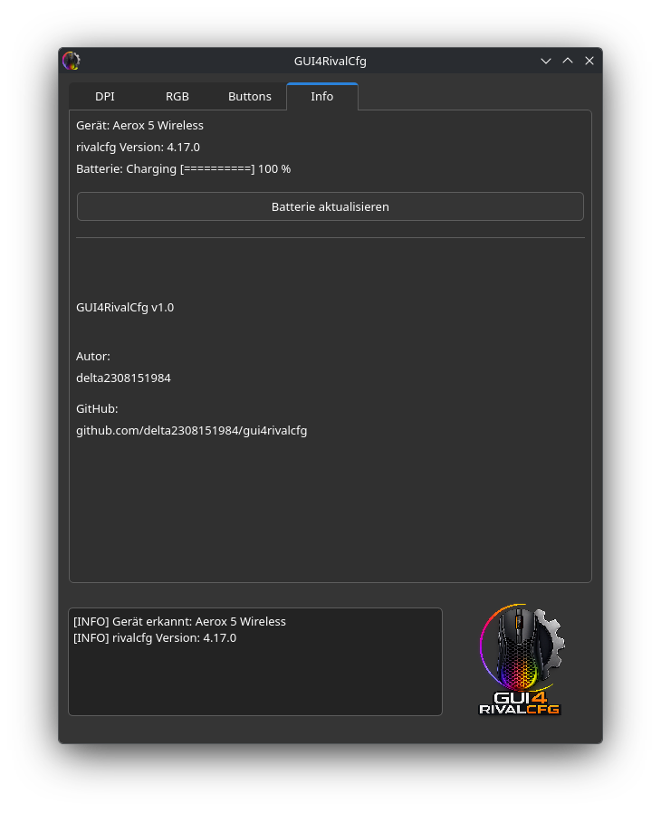

# GUI4RivalCfg

<p align="center">
  
</p>

Grafische Oberfläche für rivalcfg unter Linux.

## Unterstützte Funktionen

- DPI-Konfiguration
- RGB-Konfiguration
- Reactive-Effekt
- Rainbow-Effekt
- RGB deaktivieren
- Dim Timer
- Sleep Timer
- Button-Mapping
- Batterieanzeige

## Screenshots

| DPI | RGB |
|-----|-----|
|  |  |

| Buttons | Info |
|----------|------|
|  |  |

## Voraussetzungen

- Linux
- Python 3
- rivalcfg

## Installation

```bash
git clone https://github.com/delta2308151984/gui4rivalcfg.git
cd gui4rivalcfg
python main.py
