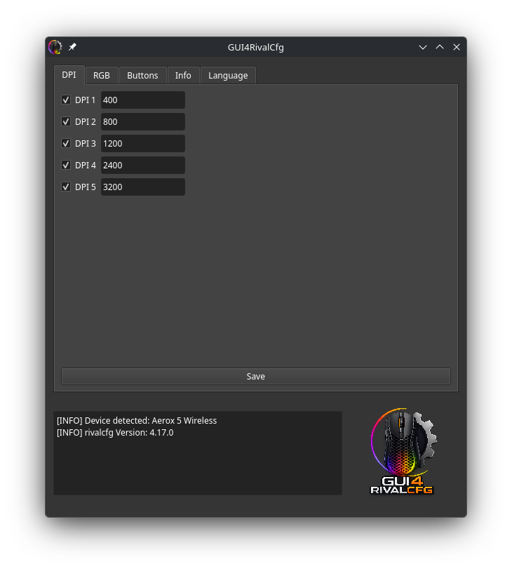
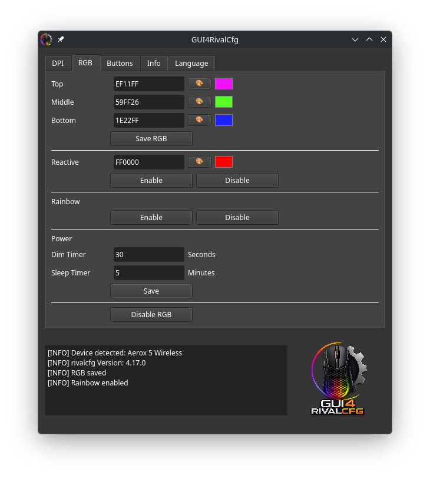
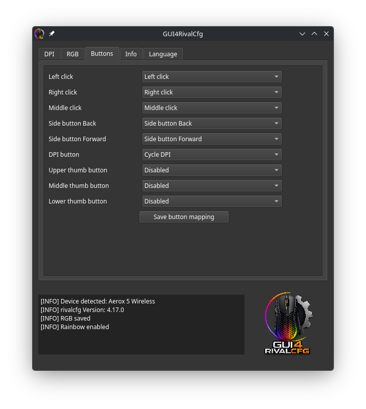
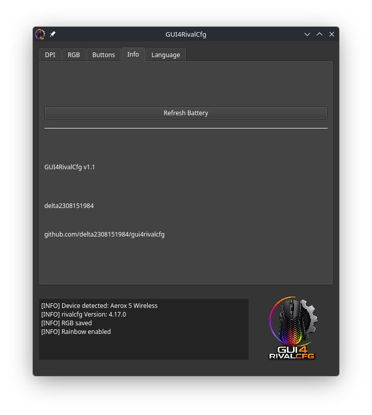
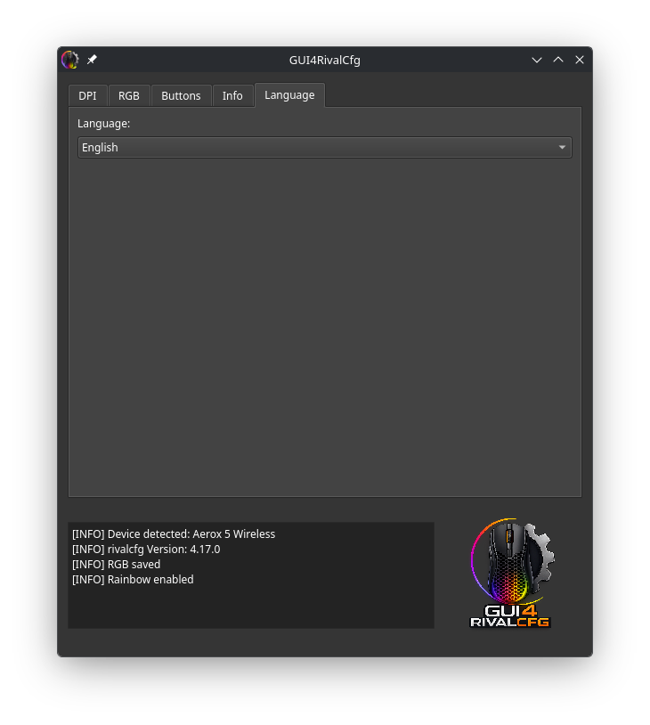

# GUI4RivalCfg

<p align="center">
  
</p>

A graphical Linux interface for configuring SteelSeries mice with
[rivalcfg](https://github.com/flozz/rivalcfg).

## Features

- DPI configuration
- RGB configuration
- Reactive lighting effect
- Rainbow lighting effect
- Disable RGB lighting
- Dim Timer
- Sleep Timer
- Button mapping
- Battery level display
- English and German user interface

See [CHANGELOG.md](CHANGELOG.md) for release history and compatibility notes.

## Screenshots

| DPI | RGB |
|-----|-----|
|  |  |

| Buttons | Info |
|----------|------|
|  |  |

| Language |
|----------|
|  |

## Requirements

- A supported SteelSeries mouse
- Linux
- Python 3
- Python venv support
- `sudo` or `pkexec` for the one-time installation of USB access rules

## Installation

1. Open the [latest release](https://github.com/delta2308151984/gui4rivalcfg/releases/latest),
   download the current `gui4rivalcfg-<version>.tar.gz` asset, and extract it.
   The version number is intentionally not fixed here, so this instruction
   remains valid for future releases.
2. Run the installer from the extracted directory:

```bash
./install.sh
```

The installer creates a user-local application directory, Python environment,
command-line launcher, and desktop menu entry. The application itself does not
run as root. If the required `rivalcfg` udev rules are missing or outdated, the
installer requests administrator confirmation once to install them. If the
mouse was already connected, unplug and reconnect it after installation.

Start the application from the desktop menu or terminal:

```bash
gui4rivalcfg
```

## Uninstallation

```bash
./uninstall.sh
```

## Running from source

```bash
python3 -m venv .venv
.venv/bin/pip install -r requirements.txt
.venv/bin/python main.py
```
